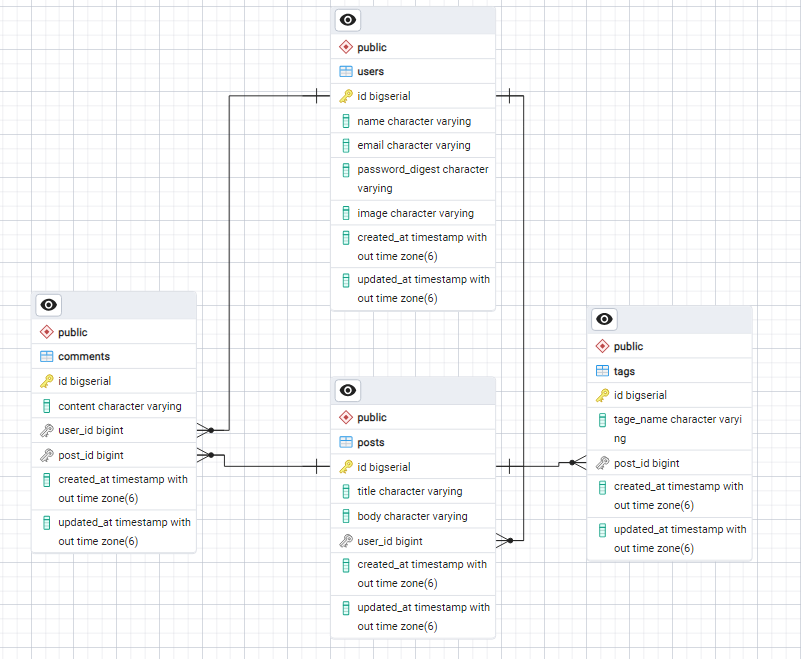

...
# Rails REST API with docker Blog App Project

...
## A fully functional example program written in ruby showing the basic CRUD operation in RoR

This project is built based on the idea of enabling the user to add posts and assosiations between posts and other entities like comments and tags.
More details on the functionalities listetd below:

* Create RESTful APIs in rails for (post, comment, tag, user)
* Deleting posts after 24 of creating the post and other related entities using Sidekiq and Redis
* Each user has the following fields (name, email, password, image)
* JWT for API authentication
* All other api endpoints are not accessible without authentication
* Users/authors can only edit/delete their own posts
* Users/authors can add comments on any post
* Users/authors can only edit/delete their own comments
* Users/authors can update the post tags
* Each post must have at least one tag

...
## ERD Diagram for the databse



## How to install and setup the project
```
1. Clone this project 
2. Run the docker-compose file using the following commands:
    a. docker-compose upgrade
    b. docker-compoer up 
3. Then you will notice the redis server, PostgreSQL and rails server running in the containers
4. You can access the server on port 3000
5. In order to run the service of sidekiq you need to run the following command inside the container:
    a. bundle exec sidekiq -c 1 
```
## Endpoints and input examples

1. User Authentication
```
Register User (POST /auth/register)
Request Example: 
    {
    "name": "Ali Ashraf",
    "email": "Ali@example.com",
    "password": "password123"
    } 
Expected Responses:
    {
    "message": "user has been created successfully"
    }
```
```

Login User (POST /auth/login)
Request Example:
    {
    "email": "Ali@example.com",
    "password": "password123"
    }
Expected Responses:
    {
    "access_token": "jwt_token_here",
    "message": "logged in"
    }
```
```
Test Authentication (GET /mo)
Request Header:
    Authorization: Bearer <access_token>
Expected Responses:
    {
    "message": "you passed"
    }
```
2. Posts API
```
Get All Posts GET /posts
Request Example:
    [
        {
            "id": 1,
            "title": "First Post",
            "body": "This is the first post content",
            "tags": [
            { "id": 1, "tage_name": "Ruby" }
            ]
        }
    ]
```
```
Create a Post POST /posts
Request Example:
    {
    "title": "New Post",
    "body": "This is a new post",
    "tags_attributes": [
        { "tage_name": "Ruby" },
        { "tage_name": "Rails" }
    ]
    }
Expected Responses:
    {
    "message": "Created Successfully"
    }
```
```
Edit a Post PATCH /posts/:id
Request Example:
    {
        "title" : "Editing the title"
    }
Expected Responses:
    {"message" : "Updated SuccessFully"}
```

3. Comments API
```
Get Comments for a Post (GET /posts/:post_id/comments)
Expected Responses:
    [
        {
            "id": 1,
            "content": "Great post!",
            "user_id": 2
           
        }
    ]
```
```
Create a Comment POST /posts/:post_id/comments
Request Payload:
    {
    "content": "Great post!"
    }
Expected Responses:
    {
        "id": 1,
        "body": "This is the updated body of the post",
        "created_at": "2025-01-19T10:31:10.173Z",
        "updated_at": "2025-01-19T10:31:10.173Z",
        "comments": [
            {
                "id": 1,
                "content": "Great post!",
                "user_id": 1,
                "created_at": "2025-01-19T16:25:52.465Z",
                "updated_at": "2025-01-19T16:25:52.465Z"
            }
        ],
        "tags": [
            {
                "id": 1,
                "tage_name": "Arabic"
            }
        ]
    }
```
```
Edit a Comment PATCH /posts/:id/comments/:id
    {
        "content" : "Amazing!"
    }
Expected Responses:
    {
        "id": 1,
        "body": "This is the updated body of the post",
        "created_at": "2025-01-19T10:31:10.173Z",
        "updated_at": "2025-01-19T10:31:10.173Z",
        "comments": [
            {
                "id": 1,
                "content": "Amazing!",
                "user_id": 1,
                "created_at": "2025-01-19T16:25:52.465Z",
                "updated_at": "2025-01-19T16:25:52.465Z"
            }
        ],
        "tags": [
            {
                "id": 1,
                "tage_name": "Arabic"
            }
        ]
    }
```
```
Delete Comment DELETE /posts/:id/comments/:id
Expected Responses:
    { "message" : "Comment deleted successfully" }
```
